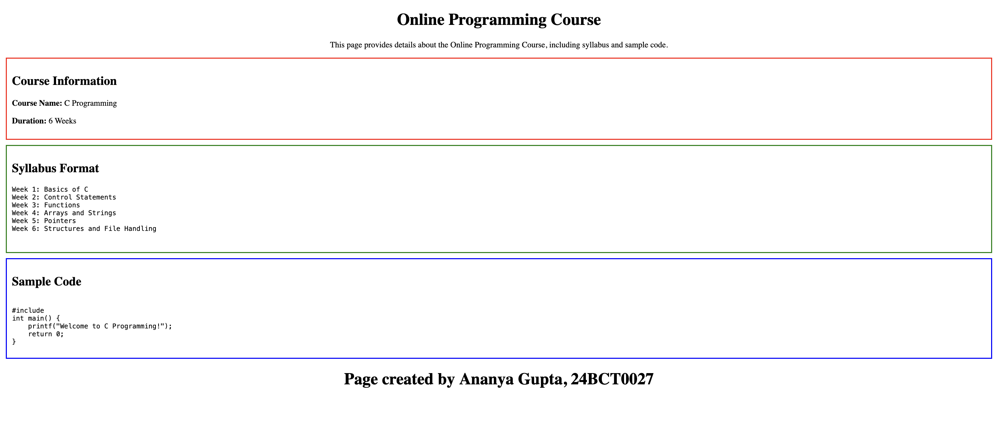

# Online Programming Course Page

This project is a simple HTML webpage that presents an online programming course.

## Features

- Structured course information section
- Preformatted syllabus using the pre tag
- Display of code snippets using the code tag
- Section separation using styled div containers

## Technologies Used

HTML

## Concepts Practiced

- HTML div containers
- Preformatted text
- Code formatting
- Basic page structure

- ## Preview

- ## Live Demo
- https://ananyagpt1105.github.io/online-programming-course-page/
